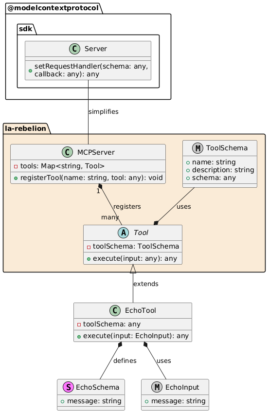

# mcp-server

> [!IMPORTANT]
> We moved the project to [Agentico](https://www.npmjs.com/package/@agentico/mcp-server) to better organize the tools and services for AI developers. We encourage you to use the new package and follow the updates on the [Agentico's GitHub repository](https://github.com/agentico-dev/mcp-server).

MCP Server is a simple server that implements the Model Context Protocol (MCP) to provide a **simpler API** to interact with the Model Context Protocol. 

## Why Use This Server?

In "[La Rebelion](https://rebelion.la)" we are working on a set of tools and services to simplify processes and workflows for a better and more efficient developer experience. This server is part of a set of tools.

MCP is amazing, but it can be a bit confusing to get started. We have create a [facade](https://refactoring.guru/design-patterns/facade) to simplify the process of creating a server that implements the Model Context Protocol. The pattern is simple, you just need to create the `tools` with your own logic, register the tools and start the server.

## Steps to Create a New Server

In the future we will provide a CLI to create a new server similar to [MCP create server](https://www.npmjs.com/package/@modelcontextprotocol/create-server), but for now you can follow the steps below based on the [official documentation to create a server](https://modelcontextprotocol.io/quickstart/server).

```bash
mkdir -p my-server/src
cd my-server/
yarn init -y
yarn add @modelcontextprotocol/sdk zod zod-to-json-schema
yarn add -D @types/node typescript
# Here lies the magic
yarn add @la-rebelion/mcp-server
```

You need to update the `package.json` file and create a `tsconfig.json` file.

## Getting Started

Implement your tools with your custom logic, and register them in the MCPServer. Here is an example of a simple `echo` tool:

```typescript
import { Tool, ToolSchema } from "@la-rebelion/mcp-server";

export class EchoTool extends Tool {
  toolSchema: ToolSchema = { 
    name: "echo",
    description: "Echoes the input message",
    schema: { // the schema for the parameters needed by the tool
      type: "object",
      properties: {
        message: { type: "string" },
      },
      required: ["message"],
    },
  };

  /**
   * Your logic here, implement the execute method to define the tool behavior
   * @param input The input message - use the schema to define the input type
   * @returns In the example, we are echoing the message
   */
  async execute(input: any): Promise<any> {
    // This is a simple echo tool demo, nothing fancy, just echoing the message
    return Promise.resolve({
      content: [
        {
          type: "text",
          text: `${input.message}` 
        }
      ]
      });
  }
}
```

Create an `index.ts` file with the following content:

```typescript
#!/usr/bin/env node
import { MCPServer } from '@la-rebelion/mcp-server'
import { EchoTool } from "./tools/EchoTool.js";

const myServer = new MCPServer('My MCP Server', '1.0.0');

async function main() {
  // Register tools
  myServer.registerTool("echo", EchoTool);
  await myServer.run();
}

main().catch((error) => {
  console.error("Server error:", error);
  process.exit(1);
});
```

That's it! You have created a simple server that implements the Model Context Protocol. Test it with [Claude Desktop](https://claude.ai/download) or any other client that supports MCP.

Build the project with the following command:

```bash
yarn build
```

You can start the server, but has no logic yet, you can test it with the following command:

```bash
yarn start
# or
node build/index.js
```

That's it, start creating your own tools and services to simplify your workflows and processes.

Go Rebels! ✊🏻

## UML Diagram



* **MCPServer**: Registers the tools that will be used by the server.
* **Tool**: Base class for all tools, containing common properties and methods. `execute` is the method that will be called when the tool is invoked, implement your logic here.
* **EchoTool**: Specific implementation of a tool, extending the Tool class and defining its own schema and initialization logic.
* **EchoSchema**: Defines the structure of the input for the EchoTool.
* **EchoInput**: Type definition for the input based on the schema.

This pattern allows for a flexible and extensible way to manage and implement tools using the MCPServer and Tool classes.

## Support Us

If you find this useful, please consider supporting us by starring this repository, by contributing to the project or by becoming a sponsor.

You can find more information on how to support us at [La Rebelion GitHub Sponsors](https://github.com/sponsors/la-rebelion). Also [buying us a coffee](https://buymeacoffee.com/larebelion), [PayPal](https://www.paypal.com/donate?hosted_button_id=7CV28AHGL9ZZY) are great ways to support us or purchasing ["La Rebelion" merch](https://go.rebelion.la/merch).

## License

This project is licensed under the MIT License - see the [LICENSE](LICENSE) file for details.