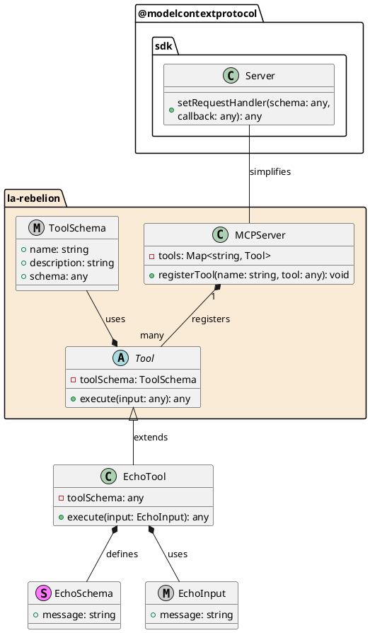

```plantuml
@startuml
!define RECTANGLE class
set separator ::

package "@modelcontextprotocol" {
  class sdk::Server {
    + setRequestHandler(schema: any,\ncallback: any): any
  }
}

package "la-rebelion" #AntiqueWhite {
  RECTANGLE MCPServer {
    - tools: Map<string, Tool>
    + registerTool(name: string, tool: any): void
  }

  abstract class Tool {
    - toolSchema: ToolSchema
    + execute(input: any): any
  }
  metaclass ToolSchema {
    + name: string
    + description: string
    + schema: any
  }
}
RECTANGLE EchoTool {
  - toolSchema: any
  + execute(input: EchoInput): any
}

stereotype EchoSchema {
  + message: string
}

metaclass EchoInput {
  + message: string
}

Server -- MCPServer : simplifies
MCPServer "1" *-- "many" Tool : registers
ToolSchema --* Tool : uses
Tool <|-- EchoTool : extends
EchoTool *-- EchoSchema : defines
EchoTool *-- EchoInput : uses

@enduml
```